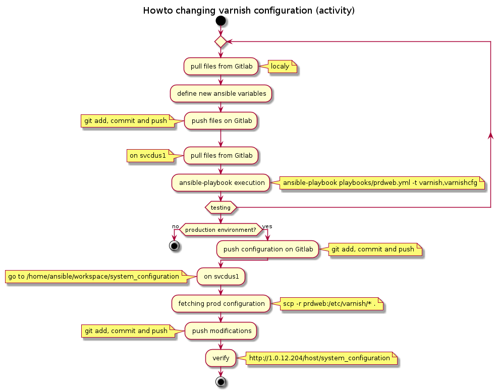
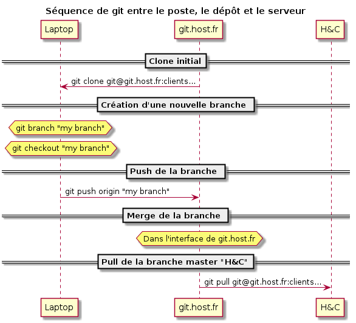

# Using plantuml for drawing beautiful uml schema

### installing plantumlme.sh

```bash
cd cmdline && sudo make install
```
## Some examples of uml schema activity and sequence 

### using plantuml

```bash
plantuml varnish1.uml
```

### Result



